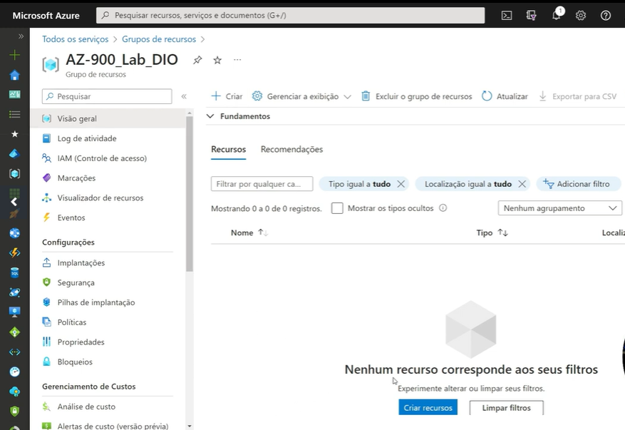
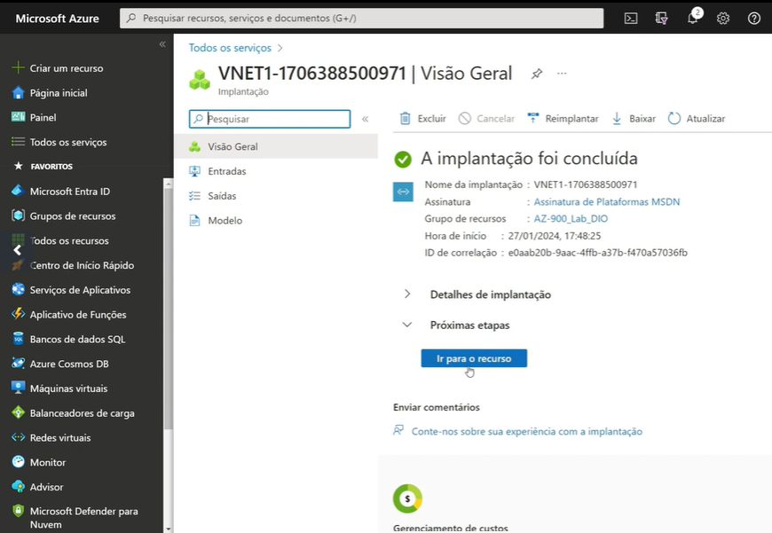
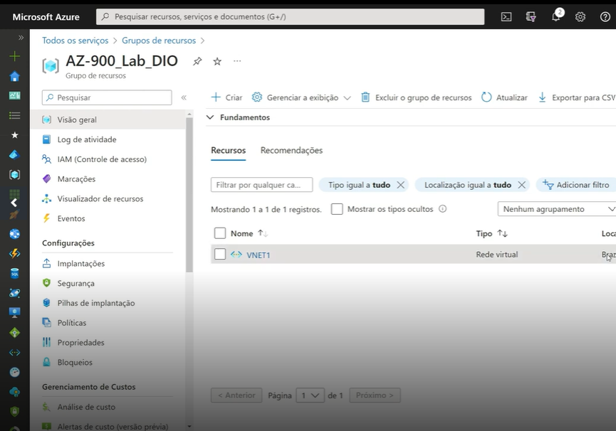

# ☁️ Configuração de Infraestrutura no Azure: Grupo de Recursos e VNet

Este guia documenta o passo a passo para a criação de um Grupo de Recursos (Resource Group) e uma Rede Virtual (Virtual Network) no portal do Microsoft Azure, incluindo a verificação de vinculação entre os recursos.

## 📋 Pré-requisitos

* Conta ativa no Microsoft Azure.
* Permissões de subscrição para criar recursos.

## 🚀 Passo a Passo

### 1. Criação do Grupo de Recursos e Gestão de Acesso

O primeiro passo é organizar os recursos criando um contêiner lógico.

1. Acesse o **Portal do Azure**.
2. Crie um novo **Grupo de Recursos**.
3. **Configurações Básicas**:
    * Selecione a **Região** desejada.
    * **Marcações (Tags)**: Não são obrigatórias, mas recomendadas para organização.
4. **Controle de Acesso (IAM)**:
    * Nesta etapa, você pode conceder ou remover permissões de usuários específicos para este grupo.

Abaixo, a visualização do Grupo de Recursos após a configuração e definição de acessos:

---

### 2. Criação da Rede Virtual (VNet)

Com o grupo criado, configuramos a infraestrutura de rede.

1. Navegue até "Redes Virtuais" e clique em **Criar**.
2. Associe a nova rede ao **Grupo de Recursos** criado no passo anterior.
3. Defina os endereços IP e sub-redes conforme a necessidade do projeto.

Tela de configuração e criação da Rede Virtual:

---

### 3. Validação e Visualizador de Recursos

Para garantir que a infraestrutura foi provisionada corretamente e que a dependência está ativa:

1. Acesse o Grupo de Recursos.
2. Utilize a ferramenta **Visualizador de Recursos** (Resource Visualizer).
3. Verifique o diagrama de dependência que mostra a Rede Virtual vinculada ao Grupo.

